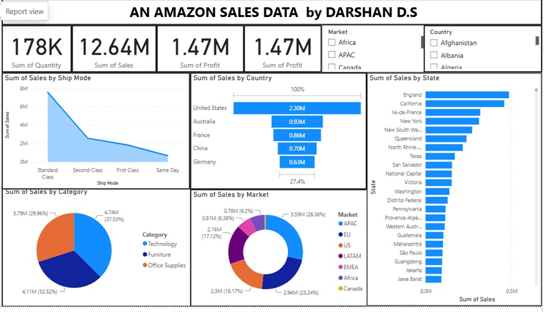

# 📊 Amazon Sales Analytics Dashboard (Power BI)

<p align="center">
    
</p>

An interactive **Amazon Sales Analytics Dashboard** built using **Microsoft Power BI** to analyze global sales performance, profitability, shipping methods, product categories, and regional sales trends through dynamic visualizations, DAX measures, and an optimized data model.

---

# 📖 Project Overview

Business Intelligence dashboards help organizations transform raw sales data into actionable insights. This project demonstrates the complete Power BI workflow, beginning with raw e-commerce data and ending with an interactive dashboard that enables users to monitor KPIs, evaluate regional performance, and identify sales trends.

The dashboard provides decision-makers with an intuitive interface to analyze revenue, profit, product categories, shipping methods, and market performance using interactive filters.

---

# 🎯 Project Objectives

- Analyze overall sales performance.
- Monitor total profit and sales quantity.
- Compare sales across different markets.
- Evaluate country-wise and state-wise sales.
- Analyze product category performance.
- Study shipping method trends.
- Build an interactive Power BI dashboard.
- Support business decisions through data visualization.

---

# 📂 Repository Structure

```text
Amazon-Sales-Analytics-PowerBI/
│
├── Dashboard.jpg
├── Amazon.pbix
├── ECOMM DATA.xlsx
└── README.md
```

---

# 📊 Dashboard Preview

<p align="center">

</p>

---

# 🧹 Data Preparation

Before creating the dashboard, the dataset was prepared by:

- Data Cleaning
- Handling Missing Values
- Data Type Validation
- Removing Duplicate Records
- Data Transformation
- Column Formatting
- Creating Derived Columns

---

# 🏗 Data Modeling

The dashboard follows a structured data model to improve reporting performance.

The data model includes:

- Fact Table
- Dimension Tables
- Relationships
- Primary Keys
- Foreign Keys

This enables efficient filtering and accurate report calculations.

---

# 🧮 DAX Measures

Several DAX measures were created to calculate key performance indicators, including:

- Total Sales
- Total Profit
- Total Quantity
- Profit Margin
- Sales by Market
- Sales by Country
- Sales by Category

---

# 📈 Dashboard KPIs

| KPI | Value |
|------|-------|
| Total Quantity | 178K |
| Total Sales | 12.64M |
| Total Profit | 1.47M |
| Profit Margin | 1.47M |

---

# 📊 Dashboard Features

- Sales by Ship Mode
- Sales by Country
- Sales by State
- Sales by Category
- Sales by Market
- KPI Cards
- Interactive Filters

---

# 🎛 Interactive Filters

Users can filter dashboard insights using:

- Market
- Country

All visuals update dynamically based on the selected filters.

---

# 🛠 Tools & Technologies

- Microsoft Power BI
- Power Query
- DAX
- Data Modeling
- Microsoft Excel
- Data Visualization

---

# 📚 Power BI Skills Demonstrated

- Data Cleaning
- Power Query
- Data Transformation
- Data Modeling
- Relationship Management
- DAX Measures
- KPI Development
- Dashboard Design
- Interactive Reporting
- Business Intelligence
- Data Visualization

---

# 📌 Business Insights

The dashboard enables businesses to:

- Monitor global sales performance
- Track profit generation
- Analyze country-wise sales
- Compare market performance
- Identify top-performing states
- Evaluate shipping methods
- Analyze product category contribution
- Support strategic business decisions

---

# 🚀 How to Use

1. Clone or download this repository.
2. Open **Amazon.pbix** using Microsoft Power BI Desktop.
3. Refresh the dataset if required.
4. Explore the interactive dashboard using the filters.
5. Analyze KPIs and business insights.

---

# 🔮 Future Improvements

- Customer Segmentation
- Forecasting
- Time Intelligence Analysis
- Drill-through Reports
- Row-Level Security (RLS)
- Automated Data Refresh
- Power BI Service Deployment

---

# 👨‍💻 Author

**Darshan D S**

Assistant Professor | Data Analytics Enthusiast

### Skills

- Power BI
- SQL
- Excel
- Tableau
- Python
- Data Analytics

---

⭐ **If you found this project useful, please consider giving it a Star!**
